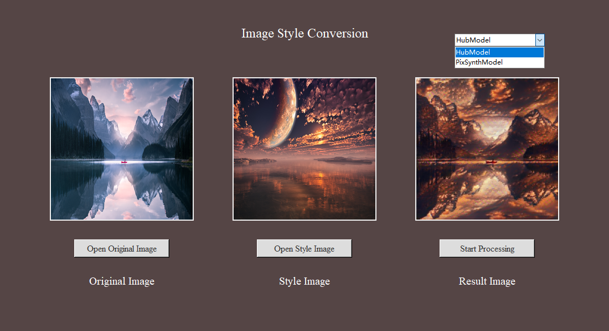

# Image Style Conversion

这个项目实现了图像的风格转换功能，它包括两个主要部分：使用 TensorFlow Hub 的预训练模型进行风格迁移和使用 VGG19 模型的自定义风格迁移实现。

## 功能

- **HubModel**：使用 TensorFlow Hub 上的预训练模型进行风格迁移。
- **PixSynthModel**：使用 VGG19 模型构建的自定义实现进行风格迁移。

## 环境需求

- Python 3.x
- TensorFlow 2.x
- TensorFlow Hub
- Matplotlib
- Numpy

## 安装指南

确保您已经安装了上述所需库。如果没有安装，可以通过以下命令安装：

```bash
pip install -r requirements.txt
```

## 使用说明

### 1. Hub Model
- 创建 `HubModel` 实例。
- 使用 `style_conver` 方法进行风格迁移。此方法需要内容图像路径、风格图像路径和结果保存路径。

示例代码：

```python
hubModel = HubModel()
hubModel.style_conver('result_path', 'content_image_path', 'style_image_path')
```

### 2. Pix Synth Model

- 创建 `PixSynthModel` 实例。
- 使用 `style_conver` 方法进行风格迁移。此方法需要内容图像路径、风格图像路径和结果保存路径。

示例代码：

```python
pixsynthModel = PixSynthModel()
pixsynthModel.style_conver('result_path', 'content_image_path', 'style_image_path')
```

### 3. Graphical User Interface

确保你的文件结构如下所示：

```bash
your-project/
├── input_images/  # 用于存放所有输入图片
├── results/       # 存放程序处理后的结果输出
├── GUI.exe        # 程序的图形用户界面启动文件
```

然后启动`GUI.exe`即可。

用户界面如下所示：



## 文件结构

项目包含以下文件和文件夹：

- `image/`：存放原始图像和风格图像的文件夹。
- `result/`：存放风格转换结果的文件夹。
- `hub_model.py`：使用 TensorFlow Hub 的预训练模型进行图像风格转换。
- `hub_model_download.py`：下载 TensorFlow Hub 的预训练模型。
- `pixsynth_model.py`：使用 Pix Synth Model 进行图像风格转换。
